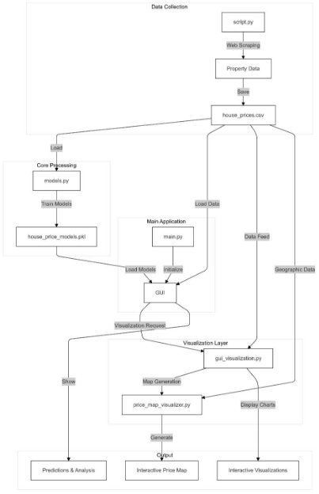
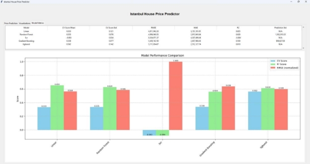
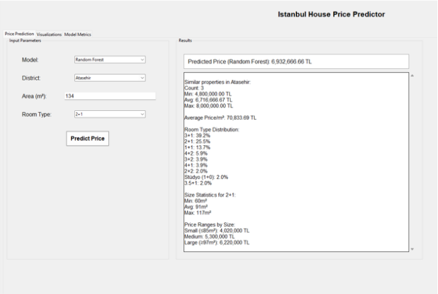
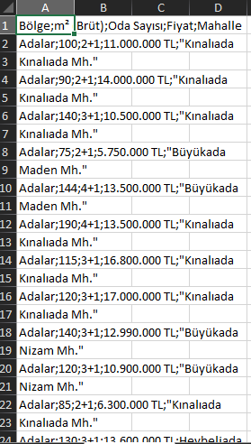
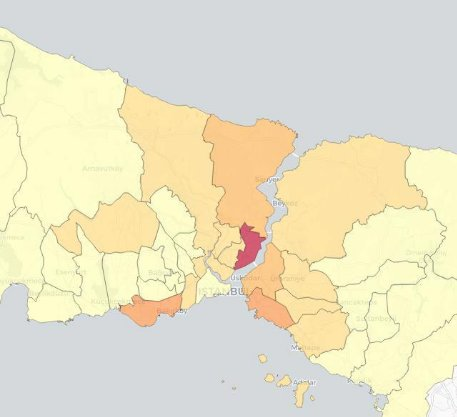

**COMP303 - Advance Python Programming Term Project Report** 

**Submitted By: Kaan Akkök** 

**Submitted To: Asst. Prof. Dr. Ali Cihan Keleş**  

**Date: 17/01/2025** 

**Section: 2** 

**Istanbul House Price Prediction and Visualization System:** 

The "Istanbul House Price Prediction and Visualization System" is a desktop application designed to predict apartment sale prices and visualize data for 39 districts in Istanbul. It offers a practical machine learning solution for both apartment buyers and sellers. 

**Group Members:** 

- Kaan Akkök – Data scraping and model training 
- Melih Gülbay – GUI and visualization 

**Abstract:** 

The Istanbul House Price Predictor is a machine learning application designed to predict house prices in Istanbul. It features an interactive GUI, advanced visualizations, and multiple robust prediction models. The project aims to provide accurate price predictions using models like Linear Regression, Random Forest, Support Vector Regression, Gradient Boosting Regressor and XGBoost.  The  application  also  offers  insights  into  district-wise  price  trends  and  room  type distributions, enhancing user understanding of the Istanbul real estate market.** 

**Introduction:** 

The Istanbul real estate market is a complex and dynamic sector, heavily influenced by Turkey's economic conditions. This complexity often makes it challenging to accurately predict property prices or analyze market trends. The "Istanbul House Price Prediction and Visualization System" aims to address these challenges using machine learning and data visualization tools. 

The primary objective of this project is to assist both real estate professionals and potential buyers in making informed decisions. By combining predictive modeling with interactive visualizations, the application provides valuable insights into district-wise price trends. Furthermore, the project highlights the importance of leveraging advanced technologies to improve understanding in real estate transactions. 

This report provides an overview of the project. Each section of this report outlines a key stage of the  project,  from  data  collection  and  model  training  to  visualization  and  user  interface development, ensuring a comprehensive understanding of the system and its capabilities.** 

**Design:** 

The House Price Predictor application is built on a modular and maintainable architecture that emphasizes scalability and reliability. 

- **Data Collection Module (script.py):** 
- We used undetected\_chromedriver, selenium and csv libraries for web scraping and data saving. 
- We retrieve the region, gross, number of rooms, price and neighborhood data of houses in the districts of Istanbul from sahibinden.com with the script.py file and store this data as a csv file (1969 data).  
- Then we extract "TL" from the price values in the dataset and convert it to a float value, and clean the empty or missing rows from the dataset.  
- Then we determine the parameters for our models. These are: 
- X (independent variables): 
  - gross(m^2) 
  - number of rooms 
  - region (converted to binary value with one-hot encoding) 
- Y (dependent variable): 
- price(TL) 
- **Models Module (models.py):** 
- Machine learning tools implementation:** 
- Linear Regression:  Assumes a linear relationship  between features  and target; simple and interpretable. 
- Random  Forest:  Uses  multiple  decision  trees  to  improve  accuracy  and reduce overfitting; handles non-linear relationships well. 
- SVR (Support Vector Regression): Fits data within a margin; effective in high-dimensional spaces; requires feature scaling. 
- Gradient Boosting Regression: Sequentially builds trees to correct errors; captures complex patterns but can overfit. 
- XGBoost: An efficient, regularized version of gradient boosting; excels in performance and scalability. 
- We train our models with the data we have prepared. Then we save models to house\_price\_models.pkl file with pickle liblary. Then we evaluate the results of these models. 
- For evaluation: 
- Cross-validation 
- RMSE (Root Mean Square Error) 
- MAE (Mean Absolute Error) 
- R^2 Score 
- models testing 
- By comparing the obtained metrics, we show the best performing model. 
- **Visualization Modules (gui\_visualization.py, price\_map\_visualizer.py):** 
- Geographic price distribution mapping. 
- Statistical charts and graphs. 
- PDF export functionality. 
- **Prediction module (gui\_prediction.py):** 
- User input handling. 
- Statistical analysis of predictions. 
- Real-time price predictions. 
- **Performance Metrics (gui\_metrics.py):** 
- Model performance visualization. 
- performance dashboards. 
- **Technical Features:** 
- Python-based implementation. 
- Tkinter for GUI development. 
- Scikit-learn for machine learning. 
- Matplotlib and Seaborn for visualization. 
- Selenium for data collection. 
- Pandas for data manipulation. 

This modular design ensures scalability for new features, easy maintenance, robustness and clear separation of concerns. 

**Methodology:** 

The Istanbul House Price Prediction and Visualization System project was carried out using a systematic approach, incorporating various processes, tools, and techniques to achieve the desired outcomes. Below is a detailed methodology: 

1. **Processes:** 
- Data was collected from sahibinden.com, a popular Turkish real estate website, using web scraping tools. 
- The script.py file leveraged Selenium and undetected\_chromedriver for dynamic content scraping. 
- Collected data (region, gross area, number of rooms, price, neighborhood) was stored in a csv file format for further processing. 
- The data cleaning process involved converting price data from string to float, removing missing or empty rows and applying one-hot encoding to transform categorical data. 
- Independent variables (X) included gross (m²), number of rooms, and region, while the dependent variable (Y) was price (TL). 
2. **Model Training and Evaluation:** 
- Several  machine learning algorithms  were implemented in  the models.py file. These  are  Linear  Regression,  Random  Forest  Regression,  Support  Vector Regression,  Gradient Boosting Regression and XGBoost models. 
- Each  model  was  evaluated  using  Cross-validation,  Root  Mean  Square  Error (RMSE), MAE (Mean Absolute Error) and R^2 Score metrics. 
- The models saved as a house\_price\_models.pkl file using the pickle library. 
3. **Tools and Techniques:** 
- **Programming Language and Libraries:** 
- Python served as the primary language for development. 
- Key libraries used: 
- Selenium: Dynamic web scraping. 
- Pandas: Data manipulation and preprocessing. 
- Scikit-learn: Machine learning model implementation. 
- Matplotlib and Seaborn: Data visualization. 
- Geopandas and Folium: Geographic data visualization. 
- Tkinter: Graphical User Interface (GUI) development. 
4. **Visualization Tools:** 
- The application featured statistical charts and graphs for price distribution, geographic maps showing price trends by district and pdf export functionality for visualized results. 
5. **User Interface Development:** 
- The GUI, implemented using Tkinter, allowed users to input property details, generate real-time  price  predictions,  view  interactive  performance  dashboards  and visualizations. 
6. **Technical Procedures:** 
- Hyperparameter tuning was applied to improve model accuracy. 
- The gui\_metrics.py module provided dashboards displaying model evaluation metrics and comparisons. 
- The project was divided into modules for better maintainability and scalability. 

This methodology ensured a structured approach to data collection, processing, model implementation, visualization, and user interaction, resulting in a comprehensive and scalable solution for house price prediction application. 

**Implementation and Analysis:** 

1. **Execution of Design and Methodology:** 
- Data Collection: Used Selenium to scrape data (region, gross area, rooms, price) from sahibinden.com, stored in a CSV file, cleaned, and preprocessed (one-hot encoding and converting price values from string to float and removing “TL”). 
- Model Training: Trained Linear Regression, Random Forest, SVR, Gradient Boosting, and  XGBoost  models  using  models.py.  Models  were  evaluated  with  metrics  like RMSE, MAE, and R², and saved as house\_price\_models.pkl. 
- Visualization: Used Geopandas and Folium for geographic price maps and Matplotlib for statistical charts. 
- GUI Development: Built with Tkinter, allowing predictions, trend analysis, and pdf export. 
2. **Results and Findings:** 
- Model Performance: XGBoost was the best model, with a cross-validation score of 

  0\.562 and the lowest MAE but SVR underperformed and unsuitable for the dataset.** 

**Further Studies and Recommendations:** 

- Adding image processing to take a picture of a house and using a CNN model to predict the price with extra information like district, room, region, etc.** 
- Better UI or Web supporting.** 

**Conclusion and Discussion:** 

In conclusion, I worked on models, web scraping, and data preprocessing. I implemented multiple machine learning models, and among them, XGBoost performed the best, meeting our goal of accurate price prediction. Data preprocessing, including cleaning missing values and applying one-hot encoding, helped improve the models' performance. Using Selenium for web scraping allowed us to collect detailed real estate data from sahibinden.com effectively. 

During the project, I faced some challenges, such as scraping dynamically loaded web content, which I solved by using undetected\_chromedriver liblary. Another issue was dealing with missing or inconsistent data, which I addressed by applying data preprocessing. 

This experience taught me the importance of proper data preparation and the challenges of working with real-world data. It also gave me valuable skills in using machine learning models and handling large datasets, which can help in my future projects. 

**References and Documentation:** 

- [https://www.udemy.com/course/machinelearning/ ](https://www.udemy.com/course/machinelearning/)
- [https://online.fliphtml5.com/grdgl/hfrm/ ](https://online.fliphtml5.com/grdgl/hfrm/)
- https://drive.google.com/drive/folders/1OFNnrHRZPZ3unWdErjLHod8Ibv2FfG1d?usp= sharing 
- [https://ieeexplore.ieee.org/document/8882834 ](https://ieeexplore.ieee.org/document/8882834)
- [https://www.youtube.com/watch?v=Ws5Qvh3PBY8&t=1449s ](https://www.youtube.com/watch?v=Ws5Qvh3PBY8&t=1449s)
- [https://www.youtube.com/watch?v=H8O-2Wb2pkI ](https://www.youtube.com/watch?v=H8O-2Wb2pkI)
- [https://www.sahibinden.com/ ](https://www.sahibinden.com/) (for dataset) 
- COMP303 (Advance Python Programming) resources (web scraping, csv operations, data preprocessing) 
- ACM465  (Artificial  Intelligence)  resources  (Linear  Regression,  Multiple  Linear Regression, SVR, model evaluating)** 
- [Introduction to Folium for interactive maps in python** ](https://www.youtube.com/watch?v=2Mn6IvzUKvY&list=PLCgehTvigkDNzlGnvmLqPxUjDyhMGwm-A)
- [Mapping with Python & Folium - Creating Maps from Raw CSV/JSON Data** ](https://www.youtube.com/watch?v=H8Ypb8Ei9YA)
- [tkinter — Python interface to Tcl/Tk — Python 3.13.1 documentation** ](https://docs.python.org/3/library/tkinter.html)
- [Python Tkinter - GeeksforGeeks** ](https://www.geeksforgeeks.org/python-gui-tkinter/)
- [Using Matplotlib — Matplotlib 3.10.0 documentation** ](https://matplotlib.org/stable/users/index.html)

**Appendices:** 

 

